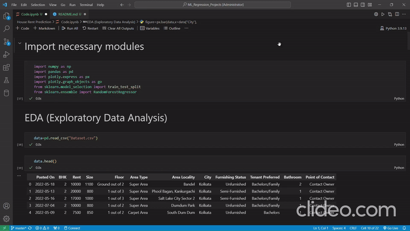

This model predicts the rental price of a house based on various factors such as city, area, floor in the house, and more.

The dataset link is [HERE](https://www.kaggle.com/datasets/iamsouravbanerjee/house-rent-prediction-dataset).

# As GitHub does not permit the inclusion of interactive Plotly images, In the README file, a GIF has been included for a quick overview of all plots. However, if you prefer high-definition images, there is also an attached video available for download, allowing you to watch the plots in HD."

